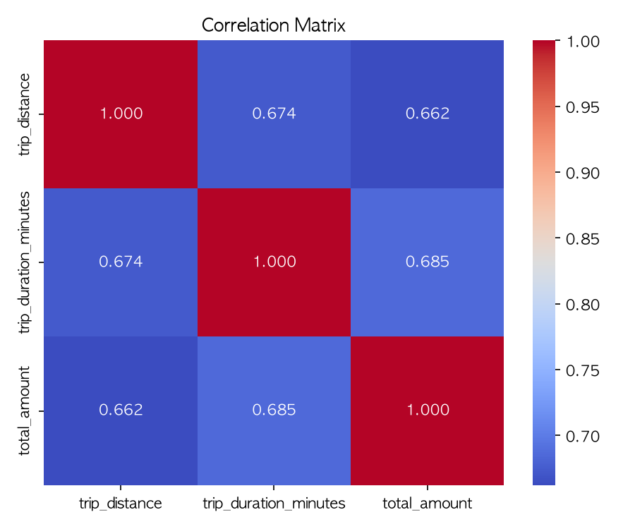

# NYC Taxi Analysis Report

## Summary

- Rows after preprocessing: 3,460,949

## Technical Statistics

                           count    mean     std    min    25%     50%     75%       max
trip_distance          3460949.0   2.241   1.693  0.010   1.02   1.700   2.930     7.960
trip_duration_minutes  3460949.0  15.262   9.800  0.017   8.25  13.233  19.967   237.833
fare_amount            3460949.0  17.061  10.412  0.000  10.00  14.440  21.900  1061.720
total_amount           3460949.0  24.969  11.993  0.750  16.95  22.260  29.940  1065.720

## Correlation Matrix

                       trip_distance  trip_duration_minutes  total_amount
trip_distance                  1.000                  0.674         0.662
trip_duration_minutes          0.674                  1.000         0.685
total_amount                   0.662                  0.685         1.000

## T-test: Rush vs Non-rush Total Amount

- Rush sample size: 1,098,555
- Non-rush sample size: 2,362,394
- Rush mean: $24.858
- Non-rush mean: $25.021
- t-statistic: -11.8930
- p-value: 1.2907e-32

## Visualizations

- Static distribution: total_amount_distribution.png
- Boxplot: total_amount_boxplot.png
- Interactive hourly average: hourly_average_total_amount.html

## Performance Comparison

        작업      도구  소요 시간(초)
0   데이터 로딩  Pandas  0.086635
1   데이터 로딩  Polars  0.024939
2      전처리  Pandas  1.222752
3      전처리  Polars  0.356896
4  시간대별 집계  Pandas  0.025534
5  시간대별 집계  Polars  0.002703

## Machine Learning Results

- MAE: 3.825
- MSE: 66.373
- R²: 0.542
- Saved model: fare_prediction_pipeline.joblib

---

Report generated automatically.