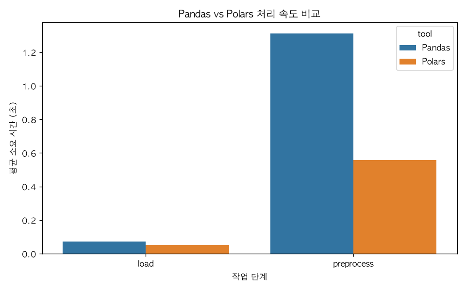

# 요금 예측 & 도구 성능 비교 분석 리포트

- 생성 일시: 2026-07-21 16:36:11
- 데이터: NYC Yellow Taxi Trip Data (2026-05), 전처리 후 3,018,292건

## 1. Pandas vs Polars 처리 속도

| 단계 | Pandas(초) | Polars(초) |
|---|---|---|
| 로딩 | 0.0726 | 0.0511 |
| 전처리 | 1.3134 | 0.5575 |



## 2. 상관분석

가설 1: 운행 시간과 이동 거리는 총요금과 강한 양의 상관관계를 가질 것이다.

```
                   trip_distance  trip_duration_min  total_amount
trip_distance           1.000000           0.780799      0.899178
trip_duration_min       0.780799           1.000000      0.748180
total_amount            0.899178           0.748180      1.000000
```

## 3. t-test: 혼잡 시간대 vs 비혼잡 시간대 평균 총요금

가설 2: 출퇴근 혼잡 시간대(08~10시, 17~19시) 운행은 비혼잡 시간대보다 평균 총요금이 높을 것이다.

- 혼잡시간대 평균: 29.13달러 (n=995928)
- 비혼잡시간대 평균: 30.27달러 (n=2022364)
- t통계량: -42.3226, p-value: 0.000000
- 결론: 가설 기각: 유의미한 차이는 있으나 방향이 반대(혼잡시간대가 오히려 낮음)

## 4. 시간대별 평균 총요금

[인터랙티브 차트 보기](hourly_fare_trend.html)

## 5. ML Pipeline: is_high_fare 분류 (총요금 상위 25%)

| 지표 | 값 |
|---|---|
| accuracy | 0.9656 |
| precision | 0.9499 |
| recall | 0.9107 |
| f1 | 0.9299 |


모델 파일: `high_fare_pipeline.joblib`