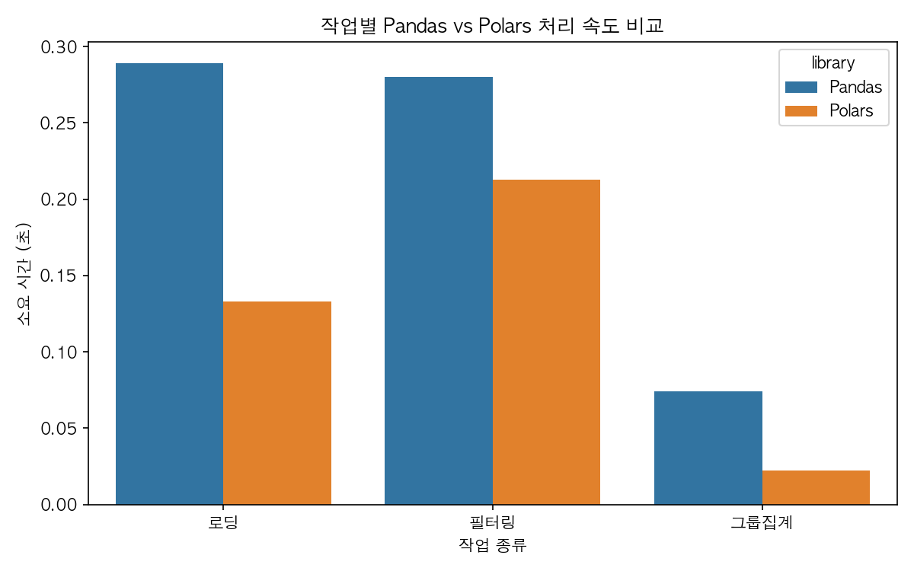

# Day2 종합실습 - 고요금 운행 예측 분석 리포트

## 1. 데이터 로딩 성능 비교 (Pandas vs Polars)

| task     |    Pandas |    Polars |
|:---------|----------:|----------:|
| 그룹집계 | 0.0743542 | 0.0220275 |
| 로딩     | 0.288836  | 0.132942  |
| 필터링   | 0.279842  | 0.212693  |

## 2. 기술통계

|       |    fare_amount |   total_amount |   trip_distance |   trip_duration_min |
|:------|---------------:|---------------:|----------------:|--------------------:|
| count |    3.91027e+06 |    3.91027e+06 |     3.91027e+06 |         3.91027e+06 |
| mean  |   21.4692      |   30.5451      |     3.51663     |        18.7985      |
| std   |   17.4002      |   21.5559      |     4.24577     |        15.4162      |
| min   |    0.01        |    1.01        |     0.01        |         0.0166667   |
| 25%   |   10           |   17.7         |     1.1         |         8.88333     |
| 50%   |   16.3         |   23.93        |     1.93        |        14.6667      |
| 75%   |   26.5         |   34.86        |     3.94        |        23.4333      |
| max   | 1061.72        | 1065.72        |    99.66        |       179.983       |

## 3. 시간대별 평균 총요금

인터랙티브 차트: [hourly_avg_total_amount.html](output/hourly_avg_total_amount.html)

## 4. 상관분석

|                   |   trip_distance |   trip_duration_min |   total_amount |
|:------------------|----------------:|--------------------:|---------------:|
| trip_distance     |        1        |            0.764132 |       0.851114 |
| trip_duration_min |        0.764132 |            1        |       0.727738 |
| total_amount      |        0.851114 |            0.727738 |       1        |

## 5. t-test: 혼잡 시간대 vs 비혼잡 시간대 총요금

- 혼잡 시간대 평균: 29.88
- 비혼잡 시간대 평균: 30.85
- t-statistic: -41.7419
- p-value: 0
- 해석: 혼잡/비혼잡 시간대의 평균 총요금은 통계적으로 유의미하게 다르다 (p < 0.05)

## 6. ML Pipeline 성능 (고요금 운행 분류)

- Accuracy: 0.9128
- F1-score: 0.8384
- 저장된 모델: `output/high_fare_pipeline.joblib`

## 7. 가설 검증 결과

| 가설 | 내용 | 결과 |
|---|---|---|
| H1 | 운행 시간·이동 거리와 총요금은 강한 양의 상관관계를 가질 것이다 | 지지됨 (거리 상관계수=0.851, 시간 상관계수=0.728) |
| H2 | 혼잡 시간대 운행이 비혼잡 시간대보다 평균 총요금이 높을 것이다 | 지지되지 않음 (p-value=0) |
